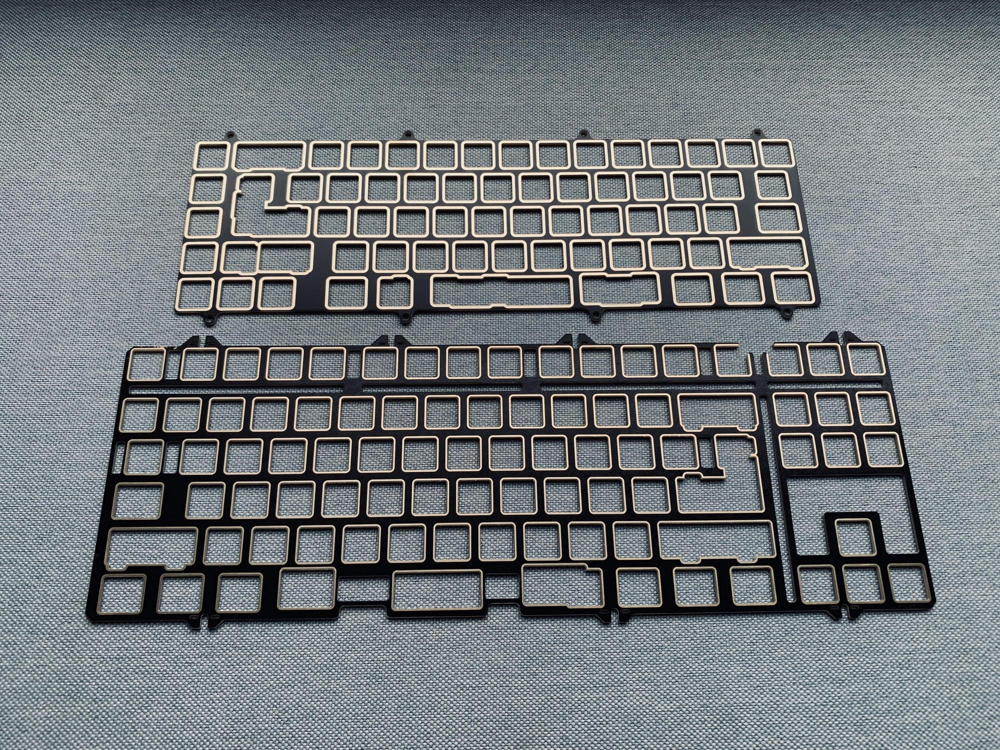
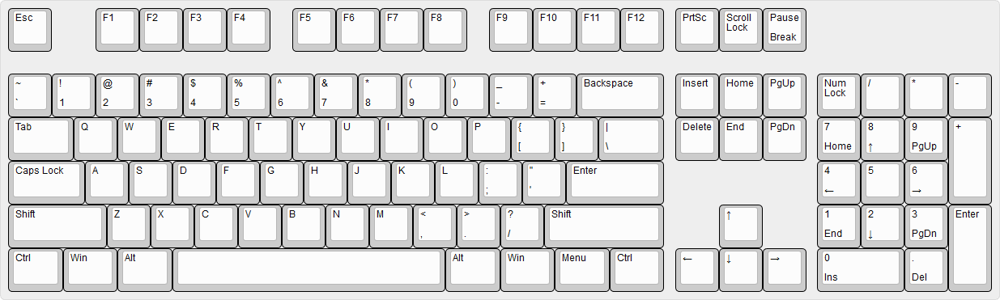
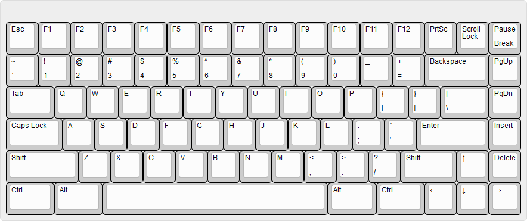
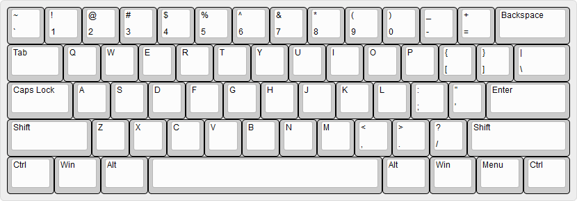

# 独具特色的机械键盘

随着当下人们的桌面工作变得越来越频繁, 对于桌面上的各种物品也有了更高的要求, 在所有桌面用品当中, 键盘是非常重要的, 至少对于经常要进行代码工作的程序员来说, 键盘是工作最基本的依托了。考虑到这一背景, 今天想要跟大家分享一种独特的键盘 -- 客制化键盘, 说到这里肯定有人想问了, 普通的键盘不好吗？我为什么需要一把客制化键盘？不都是打字吗？客制化键盘有什么独特之处？接下来就来为大家一一揭晓。  

客制化顾名思义就是按照客户的需求去定制键盘, 每个人都有每个人的个性, 每个人都会对键盘有着自己的理解, 有着自己的视角, 有着自己的理念, 客制化提供了一个平台, 大家能够在这个平台上自由发挥, 去融入一些自己的元素, 去加入一些自己的风格, 到这里, 其实可以再次提出这个问题: 为什么我会需要一把客制化键盘？

我对可能会导致差异的键盘的特点做了整理:

1. 声音与触感 (轴体, 定位板, 卫星轴, 键盘内部架构, 夹心棉, 静音垫, ...)
2. 外观和个性 (键盘的整体风格, 键盘的颜色, 键盘的结构, 键盘的装饰品, 键帽, ...)
3. 特殊功能 (滚轮, 旋钮, RGB 灯效, OLED 显示屏, ...)

以上所列出的三点原因, 大致是人们使用键盘, 感受到键盘与键盘之间的差异的最直观的几个要点, 客制化能够提供的就是你能在这些特点上自由发挥, 不断地尝试从而找到自己最心仪的那一种键盘。

在感受客制化键盘的魅力之前, 我们先来看看常规的量产键盘:

常规的键盘自然不错, 像是手感, 外观, 特殊功能等, 也大体上能够满足各式各样的人的需求, 但是正因为量产键盘为了满足大多数人的需求, 却使得各个方面变得平庸, 而失去特色, 这对于部分追求个性的年轻人来说, 这是不太能接受的, 为了在听觉, 视觉, 触觉上追求更加个性化的体验, , 客制化键盘就因此诞生。

首先先看几张关于客制化键盘的样例:

* Pearl 40%

* AngryMiao CyberBoard

(from [zfrontier](https://www.zfrontier.com/app/flow/459bRvQWJyYM))

* Matrix Abelx eva-01

(from [zfrontier](https://www.zfrontier.com/app/flow/DyAJ15a9b9RW))

* Matrix Abelx penpen

* Canoe Gen2 eva

* Morgan65

(from [zfrontier](https://www.zfrontier.com/app/flow/epJ3oA6axpE5))

* Kalam Tiamo V2 - Ti

以上都是挑选出来的一些在客制化键盘圈子中比较出名的作品, 当然客制化键盘的款式远不止如此, 也许以上几款键盘并不能很好地符合你的口味, 但是至少, 我们能发现客制化键盘有着可能性, 能够有着丰富地形态去呈现各种各样的特色。

在欣赏了一些客制化键盘的样品之后, 我们再来详细剖析客制化键盘的构成, 到底什么才是客制化键盘, 客制化键盘的客制化, 客制化在哪？

## 什么组成了一把机械键盘？

关于这个问题, 我们可以大概做一个总结, 机械键盘主要有三部分组成:  

1. 机械键盘套件 (外壳, PCB, 辅助棉料, 定位板, 装饰品, ...); 

2. 键帽; 

3. 轴体;

这三个部分基本上决定了人们使用机械键盘的体验, 声音, 手感, 外观, 这几大重要的感知都被这三个部分所能决定的事物所覆盖。

## 机械键盘套件

其实套件这个概念, 对于所有的电子 DIY 产品都是成立的, 其含义应该是能够组装成某个物体的一套构件, 机械键盘套件将键盘细化成了很多个部位, 这就使得客制化大有可为, 机械键盘套件一般被分为了几个部分:

* 外壳;
* PCB;
* 定位板; 
* 装饰条;  
...

当然由于不同作者推出的设计不同, 套件的内容也不至于此, 不过由于我们只做简单介绍, 就不再去收集一些比较特殊的案例。

### 外壳

这里说是外壳其实还没有完全表现该表现的意思, 因为外壳很多人会认为只是起到包裹或者说是便于区分样式的作用, 而外壳对于整个机械键盘的触发声音, 对于整个机械键盘的风格表现, 对于整个机械键盘的按压手感, 都有着很大的影响, 外壳不能被认为只是一层表面的包裹, 实际上, 外壳应该说是整个机械键盘的骨架, 所有的成分都必须依托于外壳而体现。

机械键盘的外壳结构非常多, 有的作者会对一些主流的结构做一些自己的调整, 从而使得整个键盘有更好的体验, 不过我们首先只对主流的结构做一个介绍:

1. 船式结构 (Tray mount);

船式结构整体来说相对比较简单, 所以加工的成本低, 整体价格来说比较低, 而且由于结构简单的原因, 能够做到不同的船式结构外壳相互兼容, 不同的外壳使用同一套内胆 (轴体 + 定位板 + PCB), 当然缺点也非常明显, 有一些独特的设计很难在船式结构上表现, 而且由于定位方式只是底部的螺丝柱, PCB 的固定不是很稳定, 所以很容易导致整体的手感不一致, 尤其是当螺丝柱断裂的情况, 手感更是直线下降。

2. 天地盖结构 (Top mount);

天地盖结构是客制化键盘中比较常见的结构, 这种结构将外壳拆成了上盖和下底两个部分, 这样的拆分对加工的精度要求比较高, 而且这种架构会要求有更多的螺丝孔, 所以这就导致了数控机床的加工工时变高进而导致了加工成本变高, 这种结构的整体价格也就变高了, 当然, 天地盖结构肯定是有优点的, 不然, 谁愿意为其高昂的成本买账呢？天地盖结构通过固定定位板来固定 PCB, 由于定位板相对来说材质更硬, 所以手感一致性会比较好, PCB 与定位板之间通过轴体在 PCB 上的焊点来连接, 焊点相对来说比较致密, 所以 PCB 与定位板之间非常稳固, 定位板被牢牢锁死, 那么 PCB 也不会松动, 这就是天地盖结构的优势, 此外, 由于天地盖的结构更为复杂, 能够呈现的设计也更加丰富多样。

3. 垫片结构 (Gasket mount);

垫片结构继承至天地盖结构, 垫片结构这样使用橡胶垫片来卡住定位板, 这使得定位板在承受来自敲击轴体的力的时候能够通过橡胶垫片来缓冲, 从而使得整体的手感非常均匀, 天地盖结构的螺丝固定相比起来会更加生硬, 而橡胶垫片固定会非常的自然, 由于其也是有上盖和下底两个部分, 所以也能够加入一些复杂的设计, 然后再说说 Gasket 结构的缺点, Gasket 结构会对橡胶垫片的精度还有上盖和下底关于橡胶垫片的开头的公差要求非常高, 这就导致了数控机床的加工工时增高, 加工的成本增高, 而且还得考虑不低的报废率。

### 定位板

之前一直有提到定位板这一概念, 实际上定位板一直存在于机械键盘内部, 由于其被键帽遮挡, 被外壳包裹, 大家一直没能意识到这一存在, 实际上定位板这一组件本就不是必须的, 例如, 下图的无钢结构 (Plateless mount):

定位板的引入, 在我看来, 更多的是为了改变轴体触发时的触感和声音, 不同的定位板与不同的轴体作用能够产生各种各样的声音, 当然无钢结构也有自己的声音, 无钢结构与有钢结构的按键触发手感也完全不同, 由于每个人的偏好不同, 很难说的上哪一种更好, 哪一种更坏, 由于市面上的有钢结构还是更多一点, 所以对于定位板这一组件的讲解是有必要的, 定位板的材质会导致声音的变化, 而后, 虽然有无定位板对于触感的改变非常大, 但是定位板的不同材质对于手感的改变就相对来说比较微弱了, 所有我们主要说明定位板的材质对于声音的改变:

1. 铜定位板 (铜密度大, 相对来说比较重, 声音沉闷, 做铜 PVD 之后会非常亮, 看上去档次很高, 由于铜价, 铜定位板相对来说比较贵)

2. 铝定位板 (铝相对密度比较小, 声音清脆, 但是空腔音比较大, 但是铝材能够做一些表面工艺, 例如, 阳极氧化, 涂层等来上色, 从而与套件的整体风格很好地搭配起来)

3. 碳纤维板 (碳纤维板比较硬, 声音清脆, 而且没有金属定位板的通病, 空腔音, 但是只能以特定的样式呈现, 有的时候会显得比较突兀而不美观)

4. fr4 定位板 (fr4 材料与 PCB 的材质相近, fr4 材料会相对来说更软, 声音也会比较沉闷, 再加上其不是金属, 所以没有空腔音, 但是敲击的时候会比较没有质感)

### PCB

PCB 是机械键盘功能实现的核心, 是机械键盘能够作为键盘的基本依托, 失去了 PCB, 那么键盘就只是好看的外壳, 这也就说明了 PCB 的重要之处, 由于客制化键盘的不同设计所带来的不同功能, 这些不同功能又使得 PCB 的布局, 功能模块有一些变化, 不过这一些变化太过于繁杂, 我们就先不去讨论这部分, 只对 PCB 的基本分类做一个介绍, 实际上真的要详细讲解整个 PCB 的电路也并不复杂, 不过我们的目的是在于简单介绍, 这方面也不再展开。

PCB 主要分为两大类:

* 焊接式 PCB;

* 热插拔式 PCB;

***焊接式 PCB***, 能够很好地固定轴体, 但是当想要更换轴体的时候, 就变得非常麻烦, 而且安装轴体的时候需要一定的焊接技术。

***热插拔式 PCB***, 安装轴体非常简单, 想要更换轴体的时候也非常方便, 但是多次更换会使得轴座的弹片松掉, 从而不得不更换轴座, 而由于轴座式贴片器件, 焊接难度对于新手来说不小, 操作不当容易使得 PCB 报废。

## 机械键盘配列

这里还必须让大家认识一个概念, 那就是键盘的配列, 键盘配列, 其实就是键盘布局, 就是键盘上按键的排列情况或是布局方式, 或者与其说是键盘的配列, 我更愿意把这称为规格, 因为键位的布局就决定了 PCB 和定位板的大小, 而 PCB 和定位板的大小又限制了外壳的大小, 从总体上来看, 配列实际上控制了整个键盘的规格。

实际上, 客制化键盘为了满足各式各样的玩法和需求, 引入了五花八门的配列, 大致可以被整理为:

1. 100% (104, 108);

2. 90% (96, 1800/980);

(from [zfrontier](https://www.zfrontier.com/app/flow/2OX3oBg5w5Xg))

3. 80%;

4. 75%;

5. 65%;

(from [zfrontier](https://www.zfrontier.com/app/flow/4578xdyk9kyO))

(from [drop](https://drop.com/talk/36475/think-6-5-r-2-2020))

6. 60%;

(from [zfrontier](https://www.zfrontier.com/app/flow/enwoZPQwLXgo?replyId=625628))

(from [ALF Studio](https://kevinhong.me/alf/DC60Gallery/))

## 机械键盘键帽

机械键盘键帽根据材质可以分为两大类: 

* ABS 材质键帽 (光滑, 平顺, 手感好, 相对来说材质较软, 耐用性差, 使用久了, 表面会被磨平, 易 "打油");

* PBT 材质键帽 (表面带有纹理, 手感不错, 相对来说材质较硬, 耐用性好, 不易 "打油");

(from [zhihu](https://www.zhihu.com/question/322802692))

机械键盘键帽根据工艺又可以分为两大类:

* 二色成型工艺 (色彩饱满, 表现力好, 但是只支持单键帽两种颜色, 成本高);

* 热升华工艺 (色彩丰富, 很容易处理得到复杂的图案, 但颜色不够饱满, 相对来说成本低);

## 机械键盘轴体

机械键盘的轴体, 也是机械键盘可谓是灵魂所在, 轴体既是机械键盘的触发器, 同时也是机械键盘的发声器, 轴体一方面决定着键盘的声音, 另一方面决定着键盘的手感, 机械键盘主要对人的听觉, 触觉, 视觉起作用, 轴体就直接占去两项, 从这一层面上, 我们就能窥见轴体的重要性。

首先先大致看一下轴体的结构:

轴体主要分为上盖, 轴心, 弹簧, 金属弹片, 下底, 造成不同轴体区别的有很多, 例如, 外壳和轴心的材质, 外壳和轴心的结构, 弹簧的材质和克数等等。

以最为标准的樱桃轴体为例, 轴体主要分为三大类:

* 线性轴 (直上直下, 通过轴心撞击轴体下底发声) -- 樱桃黑轴, 樱桃红轴;

* 段落轴 (有轻微卡顿, 通过轴心撞击轴体下底发声) -- 樱桃茶轴;

* cliky 轴 (有轻微卡顿, 通过轴心触发发声结构, 发声结构发声) -- 樱桃青轴;

之前我们也有提到, 不同定位板会导致不同的声音, 不同的轴体当然也会导致不同的声音, 不同的结构固定的方式也会影响机械键盘发声, 甚至不同的机械键盘外壳材质都会影响发声, 这样就导致了当你对键盘进行客制化的时候, 根据不同的组合将会产生了复数种声音模式。